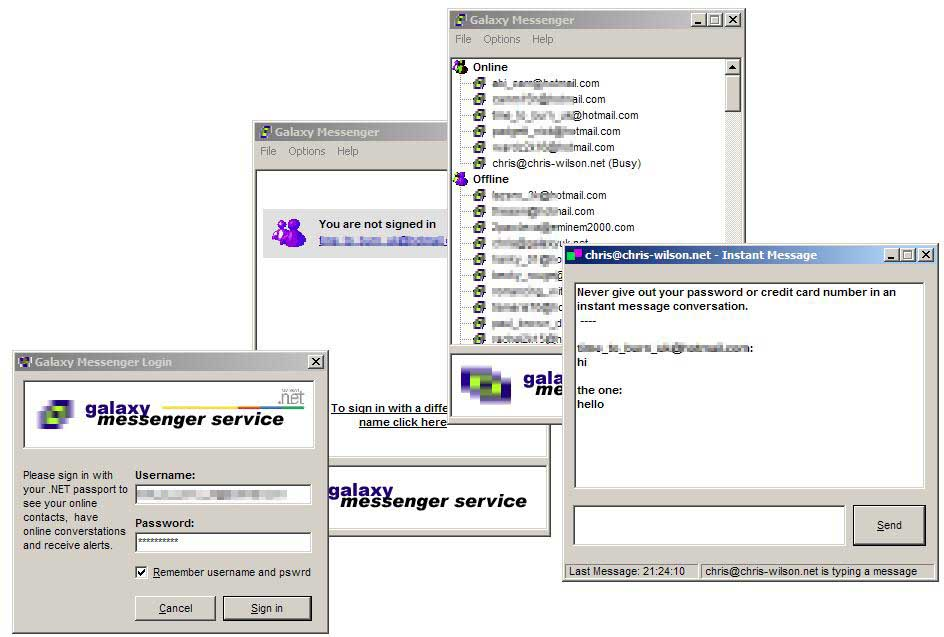



## Proper MSN Messenger Clone\!

### Description

Sign into MSN Messenger service and chat to friends online with this MSN Messenger (Windows Messenger) Clone.

Please give some feedback..
 
### More Info
 

             |
---                |---
**Submitted On**   |2002-01-07 21:08:32
**By**             |[Chris Wilson UK](https://github.com/Planet-Source-Code/PSCIndex/blob/master/ByAuthor/chris-wilson-uk.md)
**Level**          |Advanced
**User Rating**    |4.8 (140 globes from 29 users)
**Compatibility**  |VB 6\.0
**Category**       |[Internet/ HTML](https://github.com/Planet-Source-Code/PSCIndex/blob/master/ByCategory/internet-html__1-34.md)
**World**          |[Visual Basic](https://github.com/Planet-Source-Code/PSCIndex/blob/master/ByWorld/visual-basic.md)
**Archive File**   |[Proper\_MSN47068172002\.zip](https://github.com/Planet-Source-Code/chris-wilson-uk-proper-msn-messenger-clone__1-30534/archive/master.zip)

